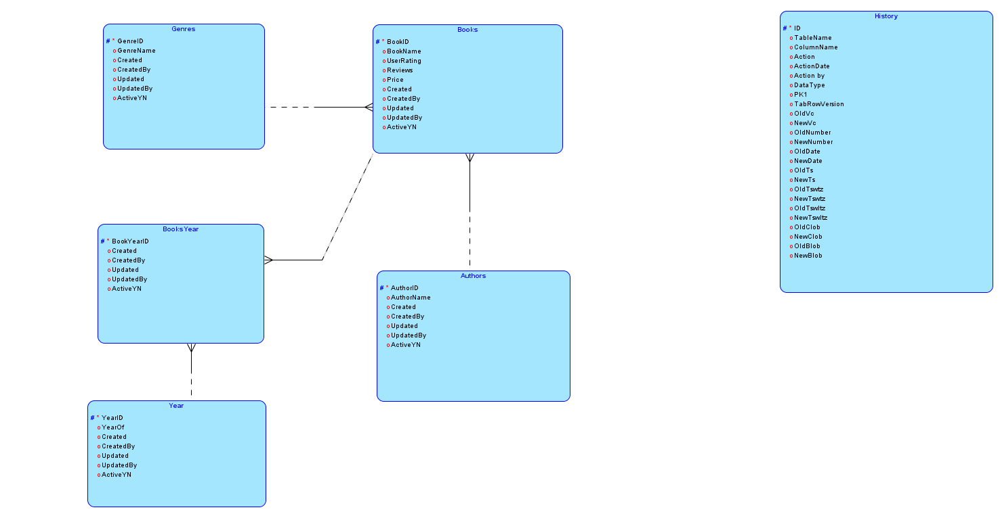
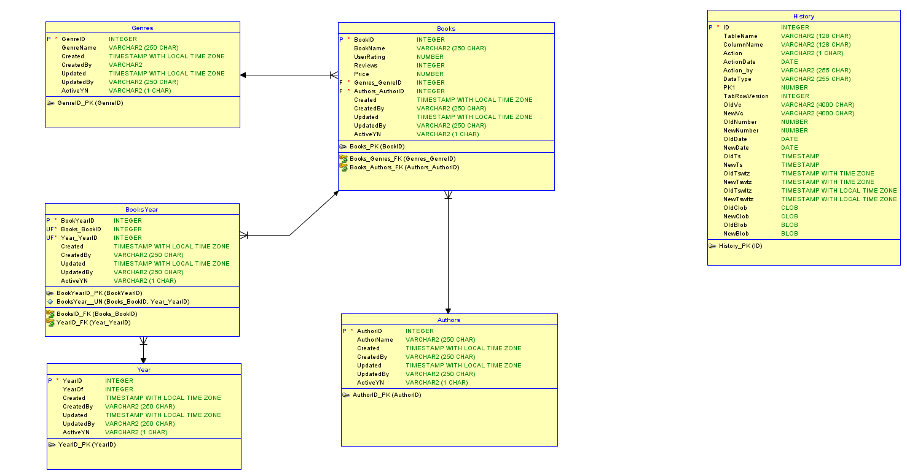

# amazon-bestselling-books
This repo is to demonstrate my ability to develop a relational database and a web app that will allow users to search and filter amazon bestselling books by name, author, genre, user rating and price. (SQL/Oracle Apex)
## Table of Contents
* [Data Source](https://github.com/KateKalashnikova/amazon-bestselling-books/blob/main/README.md#data-source)
* [Conceptual Design](https://github.com/KateKalashnikova/amazon-bestselling-books/blob/main/README.md#conceptual-design-of-database)
* [Implementation](https://github.com/KateKalashnikova/amazon-bestselling-books/blob/main/README.md#implementation)
* [Technologies](https://github.com/KateKalashnikova/amazon-bestselling-books/blob/main/README.md#technologies)

## Data Source
For this project I downloaded a dataset from Kaggle.com: https://www.kaggle.com/sootersaalu/amazon-top-50-bestselling-books-2009-2019.

## Conceptual design of Database
## 1. Logical Model
### There are 5 entities with the following attributes:
1. Books - Main Table
* BookID
* BookName
* UserRating
* Reviews
* Price
* Created
* CreatedBy
* Updated
* UpdatedBy
* ActiveYN
2. Genres - Child Table
* GenreID
* GenreName
* Created
* CreatedBy
* Updated
* UpdatedBy
* ActiveYN
3. Authors
* AuthorID
* AuthorName
* Created
* CreatedBy
* Updated
* UpdatedBy
* ActiveYN
4. Year - Child Table
* YearID
* YearOf
* ActiveYN
5. BooksYear - Intermediate Table (breaks Many-to-Many relationship between Books and Year)
* BookYearID
* BookID
* YearID
* Created
* CreatedBy
* Updated
* UpdatedBy
* ActiveYN
6*. History table - to track any changes done in the database

## 2. Relational Model
The relational model showcases relations between tables and table constraints:

## Implementation
### Population of the Database
Populating the database in the following order:
1. Child tables (Genres, Authors, Year)
2. Main table (Books)
3. Intermediate table (BooksYear)

### Web App development
In progress

## Technologies
The following technologies were used:
* PowerQuerry
* SQL Developer Data Modeler
* Oracle Apex
* SublimeText

